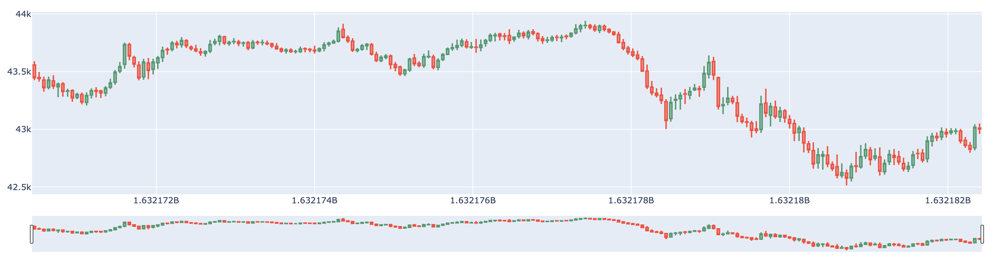

# Data Science Homework3

### *The purpose of Homework3 is to "Use Python to analyze some data sets with missing data (NA)".*

Since I found that it was too inefficient to write reports, the code needed to be cut off constantly, and there were many visual tools that could not be easily presented in PDF format, I decided to save the code directly through Github and use Markdown syntax to type out the text to explain my steps at the beginning of my third assignment.

## Overview
<!--
我所選擇的資料集是基於Kaggle競賽：**G-Research Crypto Competition** 所提供的資料，該競賽為了比賽常常會將資料挖空，來模擬真實世界中人為有意或無意造成的資料丟失。資料丟失或錯誤的狀況，可以讓ML科學家嘗試各種方法，來增強算法的魯棒性以及可用性。面對這樣的問題，我們將在這次的作業進行實作，處理資料集的資料丟失與資料錯誤問題。
-->

The dataset I have chosen is based on data provided by the Kaggle competition: **G-Research Crypto Competition**, which often guts data for competitions to simulate real-world data loss, either intentionally or unintentionally. Data loss or error conditions allow ML scientists to try various approaches to enhance the robustness and usability of algorithms. In the face of such problems, we will conduct an implementation of this assignment to deal with data loss and data error problems in datasets.


## Introduction


First, a quick introduction to the crypto world. Cryptocurrencies have become an extremely popular and volatile market, delivering massive returns (as well as losses) to investors. Thousands of cryptocurrencies have been created with a few major ones that many of you will have heard of including Bitcoin (BTC), Ether (ETH) or Dogecoin (DOGE).

Cryptocurrencies are traded extensively across crypto-exchanges, with an average volume of USD 41 billion traded daily over the last year, according to CryptoCompare (as of 25th July 2021).

Changes in prices between different cryptocurrencies are highly interconnected. For example, Bitcoin has historically been a major driver of price changes across cryptocurrencies but other coins also impact the market.


## Prerequisites
<!--
首先，基於上次作業建好的環境，我們需要在終端機先確認環境是否已經滿足所有我們將使用到的函示庫。我們需要先引入下列的函示庫，以免產生報錯。
-->
First, based on the environment built in the last job, we need to verify in the terminal that all the libraries we will use are satisfied. We need to introduce the following libraries first to avoid error reporting.

```bash=
$ pip3 install pandas
$ pip3 install numpy
$ pip3 install datetime
$ pip3 install plotly
$ pip3 install matplotlib
$ pip3 install time
$ pip3 install scipy
```


## Load the Dataset
<!--
首先先引入所有我們會使用到的 Library。
-->
Let's start by introducing all the Libraries that we will use.

```python =
import pandas as pd
import numpy as np
from datetime import datetime
```

<!--接者開始引入我們將使用的資料集：
The receiver starts introducing the dataset we will be using.

```python
data_folder = "../g-research-crypto-forecasting/"
crypto_df = pd.read_csv(data_folder + 'train.csv')
```

## Data Inspection
```python
crypto_df.describe().T.style.bar(subset=['mean'], color='#606ff2')\
                            .background_gradient(subset=['std'], cmap='BrBG')\
                            .background_gradient(subset=['min'], cmap='BrBG')\
                            .background_gradient(subset=['50%'], cmap='BrBG')
```
|| **count** | **mean** | **std** | **min** | **25%** | **50%** | **75%** | **max** |
|---|---|---|---|---|---|---|---|---|
| **timestamp** | 24236806.000000 | 1577120425.312500 | 33233501.742110 | 1514764860.000000 | 1549011480.000000 | 1578371880.000000 | 1606197540.000000 | 1632182400.000000 |
| **Asset_ID** | 24236806.000000 | 6.292544 | 4.091861 | 0.000000 | 3.000000 | 6.000000 | 9.000000 | 13.000000 |
| **Count** | 24236806.000000 | 286.459348 | 867.398158 | 1.000000 | 19.000000 | 64.000000 | 221.000000 | 165016.000000 |
| **Open** | 24236806.000000 | 1432.640492 | 6029.605020 | 0.001170 | 0.267650 | 14.288600 | 228.874286 | 64805.943750 |
| **High** | 24236806.000000 | 1436.350391 | 6039.482419 | 0.001195 | 0.268160 | 14.312500 | 229.300000 | 64900.000000 |
| **Low** | 24236806.000000 | 1429.567599 | 6020.260688 | 0.000200 | 0.266900 | 14.263000 | 228.420000 | 64670.530000 |
| **Close** | 24236806.000000 | 1432.639977 | 6029.610647 | 0.001171 | 0.267648 | 14.289200 | 228.872857 | 64808.537275 |
| **Volume** | 24236806.000000 | 286852.985610 | 2433934.645922 | -0.366281 | 141.072477 | 1295.414556 | 27297.640092 | 759755403.142386 |
| **VWAP** | 24236797.000000 | nan | nan | -inf | 0.267637 | 14.287687 | 228.872798 | inf |
| **Target** | 23486468.000000 | 0.000007 | 0.005679 | -0.509351 | -0.001694 | -0.000043 | 0.001602 | 0.964170 |

<!--透過上圖發現：<br>
- Volume存在異常，尤其是最大值 max 的地方。 <br>
- Volume-min異常，該職為交易量，不應該為負值，處理時應予以刪除。
-->
The above diagram shows that : <br>
- Volume is abnormal, especially where the maximum value is max. <br>
- Volume - min is abnormal, the job is the transaction volume, it should not be negative, and should be deleted when processing.

## Inspect the Abnormal
<!--為了分析所有14種的加密貨幣，因此這裡自行寫了一個函式，主要想法是**將加密貨幣數據中的異常數值**、**缺失值的比重**和**無限大值的比重**給抓出來。-->

In order to analyze all 14 types of cryptocurrencies, so here we wrote a function of our own, the main idea is to **catch the abnormal values**, **weight of missing values** and **weight of infinite values** in the cryptocurrency data.

``` python =
def ABN(data):
    stats = []
    for col in data.columns:
        stats.append((col, data[col].nunique(), (data[col].isnull().sum() * 100 / data.shape[0]).round(3).astype('str') + '%', 
                      (((data[col] == np.inf).sum() + (data[col] == -np.inf).sum())/data.shape[0]).round(3).astype('str') + '%',
                      (data[col].value_counts(normalize = True, dropna = False).values[0] * 100).round(3).astype('str') + '%', 
                        crypto_df[col].dtype))
        stats_df = pd.DataFrame(stats, columns=['Feature','Unique','Percentage of missing values','Percentage of infty values',
                                                  'Percentage of values in the biggest category','type'])
    return stats_df.sort_values('Percentage of missing values', ascending = False)
```
| **Index** | **Feature** | **Unique** | **Percentage of missing values** | **Percentage of infty values** | **Percentage of values in the biggest category** | **type** |
|---|---|---|---|---|---|---|
| **1** | Target | 22176025 | 3.096% | 0.0% | 3.096% | float64 |
| **2** | timestamp | 1956782 | 0.0% | 0.0% | 0.0% | int64 |
| **3** | Asset_ID | 14 | 0.0% | 0.0% | 8.072% | int64 |
| **4** | Count | 21443 | 0.0% | 0.0% | 1.928% | float64 |
| **5** | Open | 9932783 | 0.0% | 0.0% | 0.004% | float64 |
| **6** | High | 2800549 | 0.0% | 0.0% | 0.006% | float64 |
| **7** | Low | 2688809 | 0.0% | 0.0% | 0.007% | float64 |
| **8** | Close | 9909377 | 0.0% | 0.0% | 0.004% | float64 |
| **9** | Volume | 22521865 | 0.0% | 0.0% | 0.05% | float64 |
| **10** | VWAP | 23561248 | 0.0% | 0.0% | 0.002% | float64 |

## Dealing with Missing Data

<!--在知道資料存在資料缺失的問題後，我的思路是先針對其中一種貨幣進行資料的缺處裏，在完成算法後再推廣到其餘13種加密貨幣上。<br>
首先，我要處理的是索引為6的Ethereum。-->

After knowing that there is a data missing problem, my idea is to do data missing for one of the currencies first, and then extend it to the other 13 cryptocurrencies after completing the algorithm.<br>
First, I want to deal with Ethereum with index 6.

```python =
eth = crypto_df[crypto_df["Asset_ID"]==6].set_index("timestamp") # Asset_ID = 6 for Ethereum
eth.info(show_counts =True)
```


We can see the number of rows in the training set, and that there are missing values for the targets columns, which we will address later. 

```python =
eth.isna().sum()
```


Let's check the time range for Bitcoin and Ethereum data, using the coversion from timestamp to datetime.

```python =
btc.head()
```
| **timestamp** | **Asset_ID** | **Count** | **Open** | **High** | **Low** | **Close** | **Volume** | **VWAP** | **Target** |
|---|---|---|---|---|---|---|---|---|---|
| **1514764860** | 1 | 229.0 | 13835.194 | 14013.8 | 13666.11 | 13850.176 | 31.550062 | 13827.062093 | -0.014643 |
| **1514764920** | 1 | 235.0 | 13835.036 | 14052.3 | 13680.00 | 13828.102 | 31.046432 | 13840.362591 | -0.015037 |
| **1514764980** | 1 | 528.0 | 13823.900 | 14000.4 | 13601.00 | 13801.314 | 55.061820 | 13806.068014 | -0.010309 |
| **1514765040** | 1 | 435.0 | 13802.512 | 13999.0 | 13576.28 | 13768.040 | 38.780529 | 13783.598101 | -0.008999 |
| **1514765100** | 1 | 742.0 | 13766.000 | 13955.9 | 13554.44 | 13724.914 | 108.501637 | 13735.586842 | -0.008079 |

```python =
beg_btc = btc.index[0].astype('datetime64[s]')
end_btc = btc.index[-1].astype('datetime64[s]')
beg_eth = eth.index[0].astype('datetime64[s]')
end_eth = eth.index[-1].astype('datetime64[s]')

print('BTC data goes from ', beg_btc, 'to ', end_btc)
print('Ethereum data goes from ', beg_eth, 'to ', end_eth)
```


Missing asset data, for a given minute, is not represented by NaN's, but instead by the absence of those rows. We can check the timestamp difference between consecutive rows to see if there is missing data.

```python =
(eth.index[1:]-eth.index[:-1]).value_counts().head()
```


```python =
eth = eth.reindex(range(eth.index[0],eth.index[-1]+60,60),method='pad')
(eth.index[1:]-eth.index[:-1]).value_counts().head()
```


## Data Visualisation After Dealing with Missing Value

Next, visualising the Close prices for the two assets we have selected.

```python =
import matplotlib.pyplot as plt

# plot vwap time series for both chosen assets
f = plt.figure(figsize=(15,4))

# fill missing values for BTC
btc = btc.reindex(range(btc.index[0],btc.index[-1]+60,60),method='pad')

ax = f.add_subplot(121)
plt.plot(btc['Close'], label='BTC')
plt.legend()
plt.xlabel('Time')
plt.ylabel('Bitcoin')

ax2 = f.add_subplot(122)
ax2.plot(eth['Close'], color='red', label='ETH')
plt.legend()
plt.xlabel('Time')
plt.ylabel('Ethereum')

plt.tight_layout()
plt.show()
```


The trading data format is an aggregated form of market data including for Open, High, Low and Close. We can visualize this data through the commonly used candlestick bar chart, which allows traders to perform technical analysis on intraday values. The bar's body length represents the price range between the open and close of that day's trading. When the bar is red, it means the close was lower than the open, and green otherwise. These are also referred to as bullish and bearish candlesticks. The wicks above and below the bars show the high and low prices of that interval's trading.

We can visualize a slice of the Bitcoin prices using the plotly library. The bottom part of the plot shows a rangeslider, which you can use to zoom in the plot.

```python =
btc = crypto_df[crypto_df["Asset_ID"]==1].set_index("timestamp") # Asset_ID = 1 for Bitcoin
btc_mini = btc.iloc[-200:] # Select recent data rows

import plotly.graph_objects as go

fig = go.Figure(data=[go.Candlestick(x=btc_mini.index, open=btc_mini['Open'], 
                                     high=btc_mini['High'], low=btc_mini['Low'], close=btc_mini['Close'])])
fig.show()
```


## Other Method
<!--其實補齊資料的方法有很多，常見的有向前填充```bfill()```、最後觀察值推估法```ffill()```、多重插補法```Imputation()```等等。但會選擇的原因是因為，我已經往後研究整個資料集，對於加密貨幣的交易資料，如果使用一些補點的差值法，其實效果會不太好。 <br>
我推估的成因是：由於交易的資料容易起伏（這一現象在沒有限制漲跌的加密貨幣交易上更甚），所以插入更多不相干的點數，極有可能造成模型建模的不準確，會將插值的趨勢當作是一個特徵，從而忽視掉更多應該注意的細節。-->

In fact, there are many ways to complete the data, such as ``bfill()``, ``ffill()``, ``Imputation()``, and so on. But the reason I choose this method is that I have studied the whole dataset in the future, and for the cryptocurrency transaction data, if I use some complementary difference method, it will not work very well. 

My reasoning is that since the transaction data is prone to fluctuations (this is especially true for cryptocurrency transactions that have no restrictions on ups and downs), inserting more irrelevant points will most likely result in inaccurate modeling, treating the interpolated trend as a feature and neglecting more details that should be paid attention to.


## Future Work

<!--這次花費許多的心思在觀察缺失資料的部分，但也其實要歸功於Dataframe可以直接使用語句來處理。本次使用的方法是"PAD"方法，也就是當前數值廣播到後面的數值。<br>
我會在下一次的作業把資料進行視覺化，利用一些動畫、圖表、圖片等方法來將整個專題完善的更加完整。-->

A lot of effort has gone into looking at the missing data, but it is also due to the fact that Dataframes can be handled directly using statements. The method used is the "PAD" method, which means that the current value is broadcast to the subsequent values.<br>
I will visualise the data in my next assignment, using animations, diagrams, pictures, etc. to complete the whole project.


