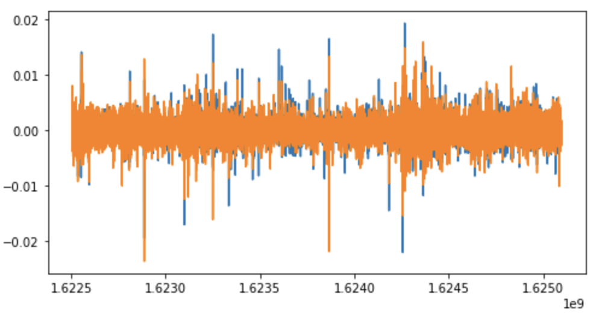

# Data Science Homework4

###### 109511119 施竣皓 2022/10/18

#### *The purpose of Homework4 is to "Conduct visualization and Explain what you find".*

## Data visualisation

We will start by visualising the Close prices for the two assets we have selected.

```python
import matplotlib.pyplot as plt

# plot vwap time series for both chosen assets
f = plt.figure(figsize=(15,4))

# fill missing values for BTC
btc = btc.reindex(range(btc.index[0],btc.index[-1]+60,60),method='pad')

ax = f.add_subplot(121)
plt.plot(btc['Close'], label='BTC')
plt.legend()
plt.xlabel('Time')
plt.ylabel('Bitcoin')

ax2 = f.add_subplot(122)
ax2.plot(eth['Close'], color='red', label='ETH')
plt.legend()
plt.xlabel('Time')
plt.ylabel('Ethereum')

plt.tight_layout()
plt.show()
```


The assets have quite different history, but we could check if they correlate in recent times.

```python
import time

# auxiliary function, from datetime to timestamp
totimestamp = lambda s: np.int32(time.mktime(datetime.strptime(s, "%d/%m/%Y").timetuple()))

# create intervals
btc_mini_2021 = btc.loc[totimestamp('01/06/2021'):totimestamp('01/07/2021')]
eth_mini_2021 = eth.loc[totimestamp('01/06/2021'):totimestamp('01/07/2021')]
```


```python
# plot time series for both chosen assets
f = plt.figure(figsize=(7,8))

ax = f.add_subplot(211)
plt.plot(btc_mini_2021['Close'], label='btc')
plt.legend()
plt.xlabel('Time')
plt.ylabel('Bitcoin Close')

ax2 = f.add_subplot(212)
ax2.plot(eth_mini_2021['Close'], color='red', label='eth')
plt.legend()
plt.xlabel('Time')
plt.ylabel('Ethereum Close')

plt.tight_layout()
plt.show()
```


On shorter intervals we can visually see some potential correlation between both assets, with some simultaneous ups and downs. A better format for analyzing such movements is by calculating asset returns.

## Candlestick charts

The trading data format is an aggregated form of market data including for Open, High, Low and Close. We can visualize this data through the commonly used candlestick bar chart, which allows traders to perform technical analysis on intraday values. The bar's body length represents the price range between the open and close of that day's trading. When the bar is red, it means the close was lower than the open, and green otherwise. These are also referred to as bullish and bearish candlesticks. The wicks above and below the bars show the high and low prices of that interval's trading.

We can visualize a slice of the Bitcoin prices using the plotly library. The bottom part of the plot shows a rangeslider, which you can use to zoom in the plot.

```python =
btc = crypto_df[crypto_df["Asset_ID"]==1].set_index("timestamp") # Asset_ID = 1 for Bitcoin
btc_mini = btc.iloc[-200:] # Select recent data rows

import plotly.graph_objects as go

fig = go.Figure(data=[go.Candlestick(x=btc_mini.index, open=btc_mini['Open'], 
                                     high=btc_mini['High'], low=btc_mini['Low'], close=btc_mini['Close'])])
fig.show()
```


##Log returns

In order to analyze price changes for an asset we can deal with the price difference. However, different assets exhibit different price scales, so that the their returns are not readily comparable. We can solve this problem by computing the percentage change in price instead, also known as the return. This return coincides with the percentage change in our invested capital.

Returns are widely used in finance, however log returns are preferred for mathematical modelling of time series, as they are additive across time. Also, while regular returns cannot go below -100%, log returns are not bounded.

To compute the log return, we can simply take the logarithm of the ratio between two consecutive prices. The first row will have an empty return as the previous value is unknown, therefore the empty return data point will be dropped.

```python
# define function to compute log returns
def log_return(series, periods=1):
    return np.log(series).diff(periods=periods)
```
We can visualize the log return for our two assets. See how the signal now looks more like white noise, with less drift than the time series for prices.

```python
import scipy.stats as stats

lret_btc = log_return(btc_mini_2021.Close)[1:]
lret_eth = log_return(eth_mini_2021.Close)[1:]
lret_btc.rename('lret_btc', inplace=True)
lret_eth.rename('lret_eth', inplace=True)

plt.figure(figsize=(8,4))
plt.plot(lret_btc);
plt.plot(lret_eth);
plt.show()
```


## Correlation between assets

We hypothesized before that crypto asset returns may exhibit some correlation. Let's check this in more detail now.

We can check how the correlation between Bitcoin and Ethereum change over time for the 2021 period we selected.

```python
# join two asset in single DataFrame

lret_btc_long = log_return(btc.Close)[1:]
lret_eth_long = log_return(eth.Close)[1:]
lret_btc_long.rename('lret_btc', inplace=True)
lret_eth_long.rename('lret_eth', inplace=True)
two_assets = pd.concat([lret_btc_long, lret_eth_long], axis=1)

# group consecutive rows and use .corr() for correlation between columns
corr_time = two_assets.groupby(two_assets.index//(10000*60)).corr().loc[:,"lret_btc"].loc[:,"lret_eth"]

corr_time.plot();
plt.xticks([])
plt.ylabel("Correlation")
plt.title("Correlation between BTC and ETH over time");
```


Note the high but variable correlation between the assets. Here we can see that there is some changing dynamics over time, and this would be critical for this time series challenge, that is, how to perform forecasts in a highly non-stationary environment.

A stationary behaviour of a system or a process is characterized by non-changing statistical properties over time such as the mean, variance and autocorrelation. On the other hand, a non-stationary behaviour is characterized by a continuous change of statistical properties over time. Stationarity is important because many useful analytical tools and statistical tests and models rely on it.

We can also check the correlation between all assets visualizing the correlation matrix. Note how some assets have much higher pairwise correlation than others.

```python
# create dataframe with returns for all assets
all_assets_2021 = pd.DataFrame([])
for asset_id, asset_name in zip(asset_details.Asset_ID, asset_details.Asset_Name):
  asset = crypto_df[crypto_df["Asset_ID"]==asset_id].set_index("timestamp")
  asset = asset.loc[totimestamp('01/01/2021'):totimestamp('01/05/2021')]
  asset = asset.reindex(range(asset.index[0],asset.index[-1]+60,60),method='pad')
  lret = log_return(asset.Close.fillna(0))[1:]
  all_assets_2021 = all_assets_2021.join(lret, rsuffix=asset_name, how="outer")
```

```python
asset_details.Asset_ID, asset_details.Asset_Name
```


```python
plt.imshow(all_assets_2021.corr());
plt.yticks(range(14), asset_details.Asset_Name.values);
plt.xticks(range(14), asset_details.Asset_Name.values, rotation='vertical');
plt.colorbar();
```


We encourage participants to perform additional statistical analyses to have a stronger grasp on the dataset, including autocorrelation, time-series decomposition and stationarity tests.

## Future Work

This assignment has been a great way to visualise the whole data, but unfortunately for financial data, there are many other visualisation packages that cannot be used.

For next week's assignment I will be starting to analyse missing data to conduct Exploratory Data Analysis (EDA).