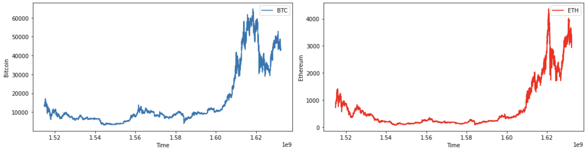
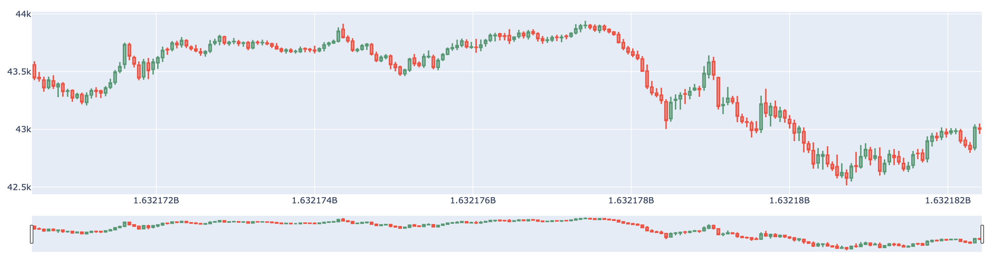
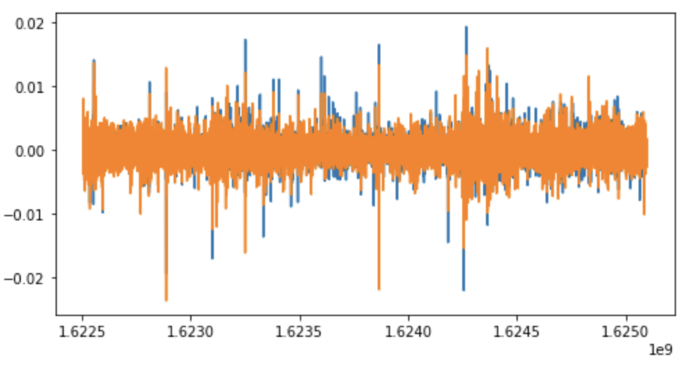

# Data Science Homework5

###### 109511119 施竣皓 2022/10/25

### *The purpose of Homework5 is to "conduct Exploratory Data Analysis (EDA)".*

## Overview
<!--
我所選擇的資料集是基於Kaggle競賽：**G-Research Crypto Competition** 所提供的資料，該競賽為了比賽常常會將資料挖空，來模擬真實世界中人為有意或無意造成的資料丟失。資料丟失或錯誤的狀況，可以讓ML科學家嘗試各種方法，來增強算法的魯棒性以及可用性。面對這樣的問題，我們將在這次的作業進行實作，處理資料集的資料丟失與資料錯誤問題。
-->

The dataset I have chosen is based on data provided by the Kaggle competition: **G-Research Crypto Competition**, which often guts data for competitions to simulate real-world data loss, either intentionally or unintentionally. Data loss or error conditions allow ML scientists to try various approaches to enhance the robustness and usability of algorithms. In the face of such problems, we will conduct an implementation of this assignment to deal with data loss and data error problems in datasets.

## Prerequisites
<!--
首先，基於上次作業建好的環境，我們需要在終端機先確認環境是否已經滿足所有我們將使用到的函示庫。我們需要先引入下列的函示庫，以免產生報錯。
-->
First, based on the environment built in the last job, we need to verify in the terminal that all the libraries we will use are satisfied. We need to introduce the following libraries first to avoid error reporting.

```bash=
$ pip3 install pandas
$ pip3 install numpy
$ pip3 install datetime
$ pip3 install plotly
$ pip3 install matplotlib
$ pip3 install time
$ pip3 install scipy
```
## Load the Dataset
<!--
首先先引入所有我們會使用到的 Library。
-->
Let's start by introducing all the Libraries that we will use.

```python =
import pandas as pd
import numpy as np
from datetime import datetime
```

<!--接者開始引入我們將使用的資料集：-->
The receiver starts introducing the dataset we will be using.

```python
data_folder = "../g-research-crypto-forecasting/"
crypto_df = pd.read_csv(data_folder + 'train.csv')
```

## Data Inspection
```python
crypto_df.describe().T.style.bar(subset=['mean'], color='#606ff2')\
                            .background_gradient(subset=['std'], cmap='BrBG')\
                            .background_gradient(subset=['min'], cmap='BrBG')\
                            .background_gradient(subset=['50%'], cmap='BrBG')
```
|| **count** | **mean** | **std** | **min** | **25%** | **50%** | **75%** | **max** |
|---|---|---|---|---|---|---|---|---|
| **timestamp** | 24236806.000000 | 1577120425.312500 | 33233501.742110 | 1514764860.000000 | 1549011480.000000 | 1578371880.000000 | 1606197540.000000 | 1632182400.000000 |
| **Asset_ID** | 24236806.000000 | 6.292544 | 4.091861 | 0.000000 | 3.000000 | 6.000000 | 9.000000 | 13.000000 |
| **Count** | 24236806.000000 | 286.459348 | 867.398158 | 1.000000 | 19.000000 | 64.000000 | 221.000000 | 165016.000000 |
| **Open** | 24236806.000000 | 1432.640492 | 6029.605020 | 0.001170 | 0.267650 | 14.288600 | 228.874286 | 64805.943750 |
| **High** | 24236806.000000 | 1436.350391 | 6039.482419 | 0.001195 | 0.268160 | 14.312500 | 229.300000 | 64900.000000 |
| **Low** | 24236806.000000 | 1429.567599 | 6020.260688 | 0.000200 | 0.266900 | 14.263000 | 228.420000 | 64670.530000 |
| **Close** | 24236806.000000 | 1432.639977 | 6029.610647 | 0.001171 | 0.267648 | 14.289200 | 228.872857 | 64808.537275 |
| **Volume** | 24236806.000000 | 286852.985610 | 2433934.645922 | -0.366281 | 141.072477 | 1295.414556 | 27297.640092 | 759755403.142386 |
| **VWAP** | 24236797.000000 | nan | nan | -inf | 0.267637 | 14.287687 | 228.872798 | inf |
| **Target** | 23486468.000000 | 0.000007 | 0.005679 | -0.509351 | -0.001694 | -0.000043 | 0.001602 | 0.964170 |

<!--透過上圖發現：<br>
- Volume存在異常，尤其是最大值 max 的地方。 <br>
- Volume-min異常，該職為交易量，不應該為負值，處理時應予以刪除。
-->
The above diagram shows that : <br>
- Volume is abnormal, especially where the maximum value is max. <br>
- Volume - min is abnormal, the job is the transaction volume, it should not be negative, and should be deleted when processing.

## Inspect the Abnormal
<!--為了分析所有14種的加密貨幣，因此這裡自行寫了一個函式，主要想法是**將加密貨幣數據中的異常數值**、**缺失值的比重**和**無限大值的比重**給抓出來。-->

In order to analyze all 14 types of cryptocurrencies, so here we wrote a function of our own, the main idea is to **catch the abnormal values**, **weight of missing values** and **weight of infinite values** in the cryptocurrency data.

``` python =
def EDA(data):
    stats = []
    for col in data.columns:
        stats.append((col, data[col].nunique(), (data[col].isnull().sum() * 100 / data.shape[0]).round(3).astype('str') + '%', 
                      (((data[col] == np.inf).sum() + (data[col] == -np.inf).sum())/data.shape[0]).round(3).astype('str') + '%',
                      (data[col].value_counts(normalize = True, dropna = False).values[0] * 100).round(3).astype('str') + '%', 
                        crypto_df[col].dtype))
        stats_df = pd.DataFrame(stats, columns=['Feature','Unique','Percentage of missing values','Percentage of infty values',
                                                  'Percentage of values in the biggest category','type'])
    return stats_df.sort_values('Percentage of missing values', ascending = False)
```
| **Index** | **Feature** | **Unique** | **Percentage of missing values** | **Percentage of infty values** | **Percentage of values in the biggest category** | **type** |
|---|---|---|---|---|---|---|
| **1** | Target | 22176025 | 3.096% | 0.0% | 3.096% | float64 |
| **2** | timestamp | 1956782 | 0.0% | 0.0% | 0.0% | int64 |
| **3** | Asset_ID | 14 | 0.0% | 0.0% | 8.072% | int64 |
| **4** | Count | 21443 | 0.0% | 0.0% | 1.928% | float64 |
| **5** | Open | 9932783 | 0.0% | 0.0% | 0.004% | float64 |
| **6** | High | 2800549 | 0.0% | 0.0% | 0.006% | float64 |
| **7** | Low | 2688809 | 0.0% | 0.0% | 0.007% | float64 |
| **8** | Close | 9909377 | 0.0% | 0.0% | 0.004% | float64 |
| **9** | Volume | 22521865 | 0.0% | 0.0% | 0.05% | float64 |
| **10** | VWAP | 23561248 | 0.0% | 0.0% | 0.002% | float64 |

## Data visualisation

We will start by visualising the Close prices for the two assets we have selected.

```python
import matplotlib.pyplot as plt

# plot vwap time series for both chosen assets
f = plt.figure(figsize=(15,4))

# fill missing values for BTC
btc = btc.reindex(range(btc.index[0],btc.index[-1]+60,60),method='pad')

ax = f.add_subplot(121)
plt.plot(btc['Close'], label='BTC')
plt.legend()
plt.xlabel('Time')
plt.ylabel('Bitcoin')

ax2 = f.add_subplot(122)
ax2.plot(eth['Close'], color='red', label='ETH')
plt.legend()
plt.xlabel('Time')
plt.ylabel('Ethereum')

plt.tight_layout()
plt.show()
```


## Candlestick charts

The trading data format is an aggregated form of market data including for Open, High, Low and Close. We can visualize this data through the commonly used candlestick bar chart, which allows traders to perform technical analysis on intraday values. The bar's body length represents the price range between the open and close of that day's trading. When the bar is red, it means the close was lower than the open, and green otherwise. These are also referred to as bullish and bearish candlesticks. The wicks above and below the bars show the high and low prices of that interval's trading.

We can visualize a slice of the Bitcoin prices using the plotly library. The bottom part of the plot shows a rangeslider, which you can use to zoom in the plot.

```python =
btc = crypto_df[crypto_df["Asset_ID"]==1].set_index("timestamp") # Asset_ID = 1 for Bitcoin
btc_mini = btc.iloc[-200:] # Select recent data rows

import plotly.graph_objects as go

fig = go.Figure(data=[go.Candlestick(x=btc_mini.index, open=btc_mini['Open'], 
                                     high=btc_mini['High'], low=btc_mini['Low'], close=btc_mini['Close'])])
fig.show()
```



##Log returns

In order to analyze price changes for an asset we can deal with the price difference. However, different assets exhibit different price scales, so that the their returns are not readily comparable. We can solve this problem by computing the percentage change in price instead, also known as the return. This return coincides with the percentage change in our invested capital.

Returns are widely used in finance, however log returns are preferred for mathematical modelling of time series, as they are additive across time. Also, while regular returns cannot go below -100%, log returns are not bounded.

To compute the log return, we can simply take the logarithm of the ratio between two consecutive prices. The first row will have an empty return as the previous value is unknown, therefore the empty return data point will be dropped.

```python
# define function to compute log returns
def log_return(series, periods=1):
    return np.log(series).diff(periods=periods)
```
We can visualize the log return for our two assets. See how the signal now looks more like white noise, with less drift than the time series for prices.

```python
import scipy.stats as stats

lret_btc = log_return(btc_mini_2021.Close)[1:]
lret_eth = log_return(eth_mini_2021.Close)[1:]
lret_btc.rename('lret_btc', inplace=True)
lret_eth.rename('lret_eth', inplace=True)

plt.figure(figsize=(8,4))
plt.plot(lret_btc);
plt.plot(lret_eth);
plt.show()
```



## Future Work

This assignment analysed the missing data for exploratory data analysis (EDA). And visualised the whole data at the end.

For next week's assignment, I will start to perform regression analysis of some data sets.
