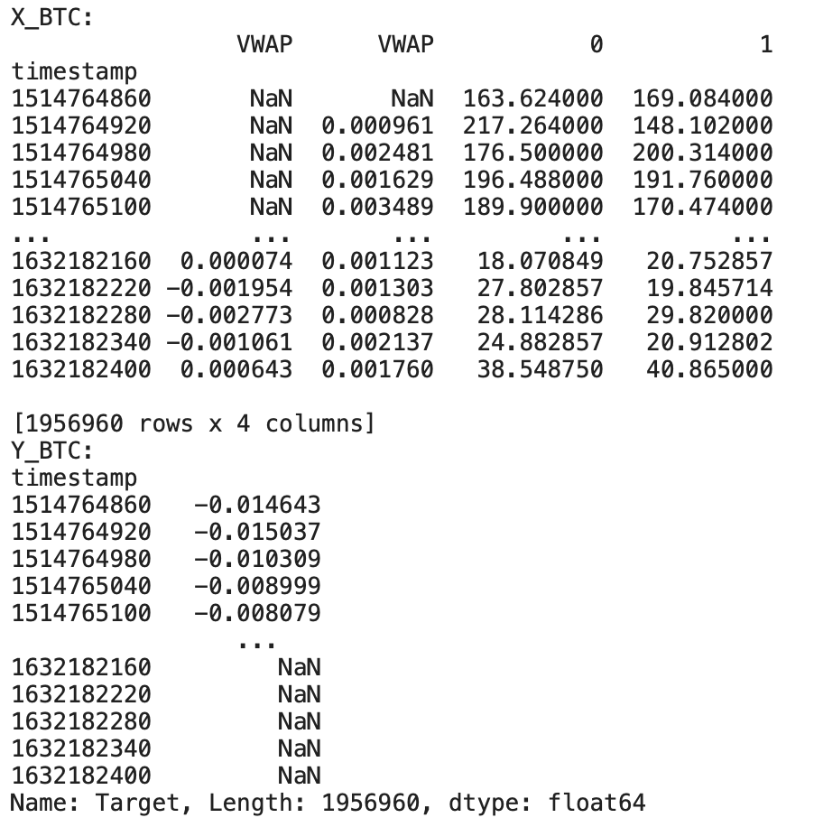
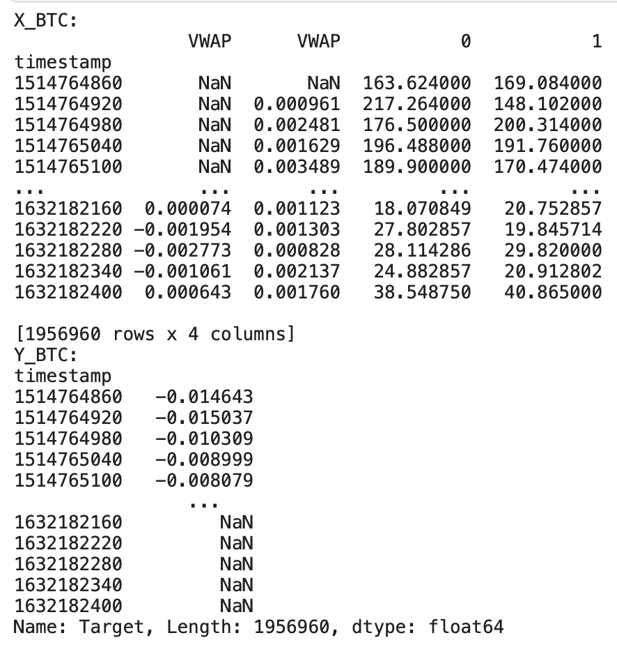
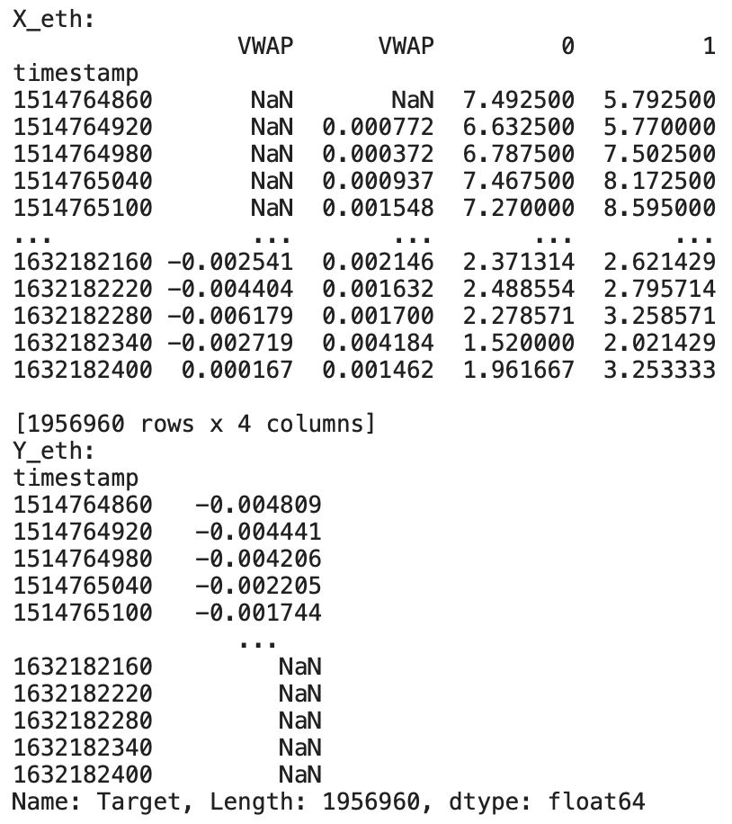
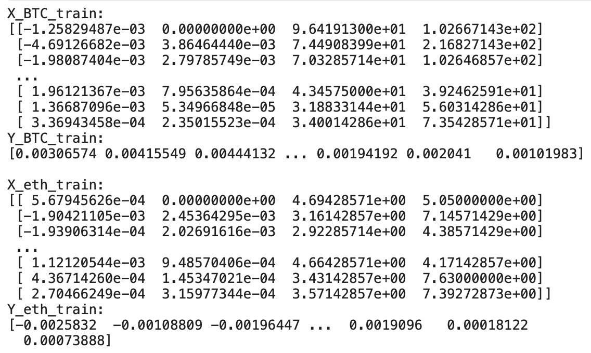
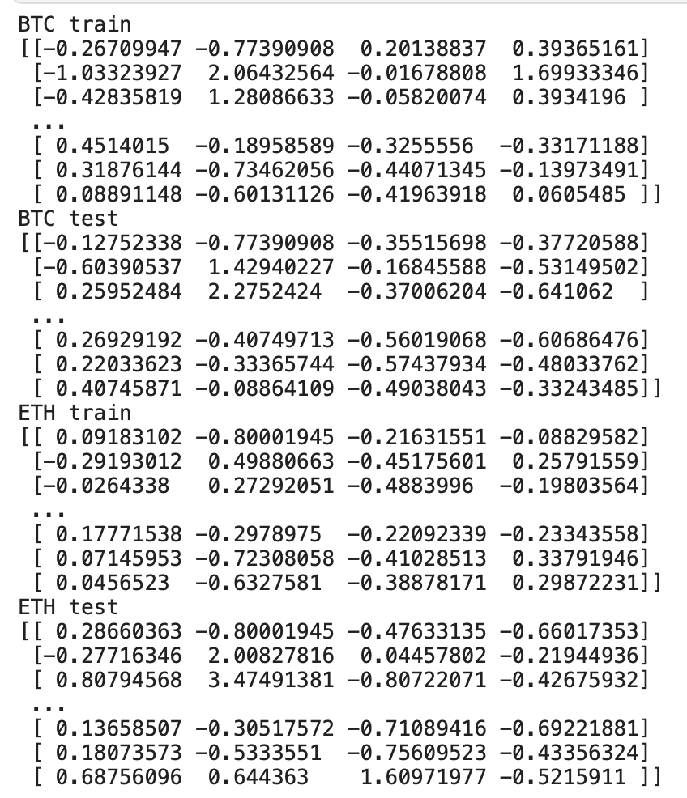
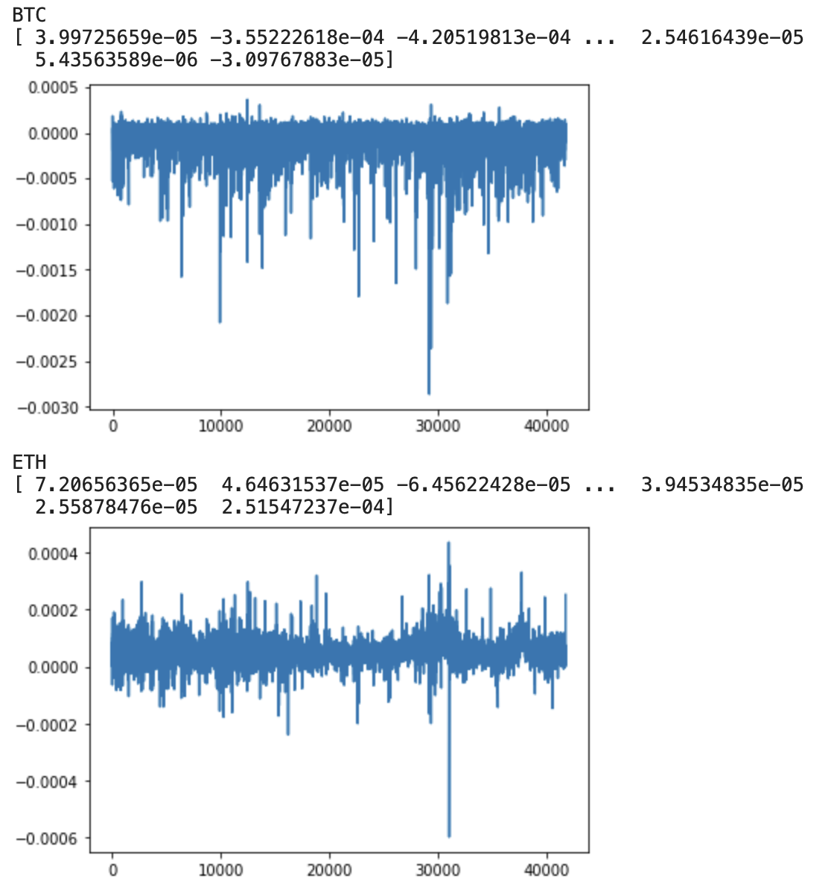
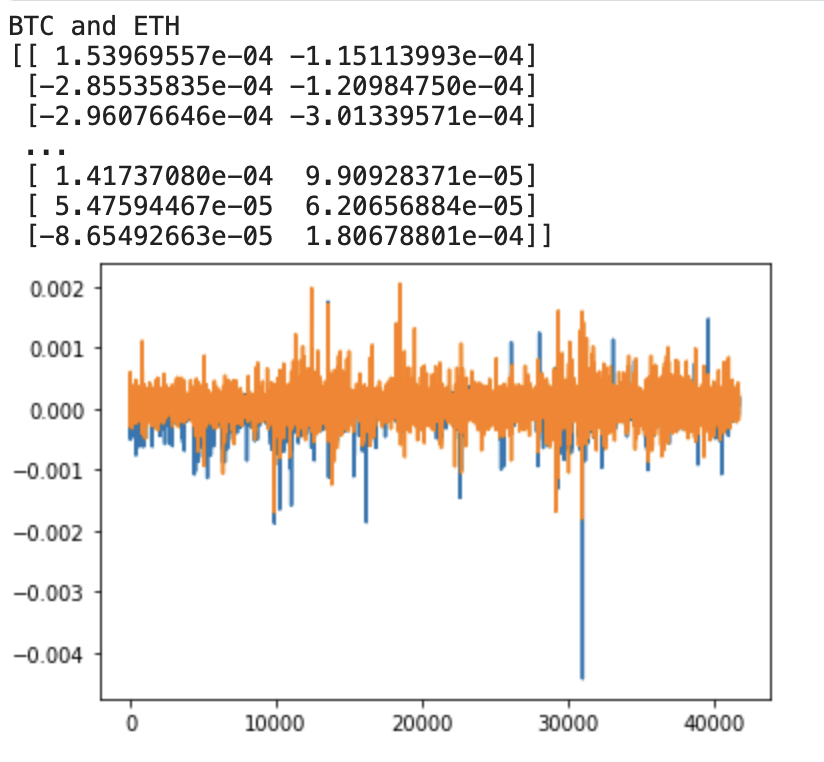

# Data Science Homework6

###### 109511119 施竣皓 2022/11/08

#### *The purpose of Homework5 is to "to perform regression analysis of data sets".*

## Overview
<!--
我所選擇的資料集是基於Kaggle競賽：**G-Research Crypto Competition** 所提供的資料，該競賽為了比賽常常會將資料挖空，來模擬真實世界中人為有意或無意造成的資料丟失。資料丟失或錯誤的狀況，可以讓ML科學家嘗試各種方法，來增強算法的魯棒性以及可用性。面對這樣的問題，我們將在這次的作業進行實作，處理資料集的資料丟失與資料錯誤問題。
-->

The dataset I have chosen is based on data provided by the Kaggle competition: **G-Research Crypto Competition**, which often guts data for competitions to simulate real-world data loss, either intentionally or unintentionally. Data loss or error conditions allow ML scientists to try various approaches to enhance the robustness and usability of algorithms. In the face of such problems, we will conduct an implementation of this assignment to deal with data loss and data error problems in datasets.

## Prerequisites
<!--
首先，基於上次作業建好的環境，我們需要在終端機先確認環境是否已經滿足所有我們將使用到的函示庫。我們需要先引入下列的函示庫，以免產生報錯。
-->
First, based on the environment built in the last job, we need to verify in the terminal that all the libraries we will use are satisfied. We need to introduce the following libraries first to avoid error reporting.

```bash=
$ pip3 install pandas
$ pip3 install numpy
$ pip3 install datetime
$ pip3 install plotly
$ pip3 install matplotlib
$ pip3 install time
$ pip3 install scipy
```
## Load the Dataset
<!--
首先先引入所有我們會使用到的 Library。
-->
Let's start by introducing all the Libraries that we will use.

```python =
import pandas as pd
import numpy as np
from datetime import datetime
```

<!--接者開始引入我們將使用的資料集：-->
The receiver starts introducing the dataset we will be using.

```python
data_folder = "../g-research-crypto-forecasting/"
crypto_df = pd.read_csv(data_folder + 'train.csv')
```

## Data visualisation

We will start by visualising the Close prices for the two assets we have selected.

```python
import matplotlib.pyplot as plt

# plot vwap time series for both chosen assets
f = plt.figure(figsize=(15,4))

# fill missing values for BTC
btc = btc.reindex(range(btc.index[0],btc.index[-1]+60,60),method='pad')

ax = f.add_subplot(121)
plt.plot(btc['Close'], label='BTC')
plt.legend()
plt.xlabel('Time')
plt.ylabel('Bitcoin')

ax2 = f.add_subplot(122)
ax2.plot(eth['Close'], color='red', label='ETH')
plt.legend()
plt.xlabel('Time')
plt.ylabel('Ethereum')

plt.tight_layout()
plt.show()
```


## Candlestick charts

The trading data format is an aggregated form of market data including for Open, High, Low and Close. We can visualize this data through the commonly used candlestick bar chart, which allows traders to perform technical analysis on intraday values. The bar's body length represents the price range between the open and close of that day's trading. When the bar is red, it means the close was lower than the open, and green otherwise. These are also referred to as bullish and bearish candlesticks. The wicks above and below the bars show the high and low prices of that interval's trading.

We can visualize a slice of the Bitcoin prices using the plotly library. The bottom part of the plot shows a rangeslider, which you can use to zoom in the plot.

```python =
btc = crypto_df[crypto_df["Asset_ID"]==1].set_index("timestamp") # Asset_ID = 1 for Bitcoin
btc_mini = btc.iloc[-200:] # Select recent data rows

import plotly.graph_objects as go

fig = go.Figure(data=[go.Candlestick(x=btc_mini.index, open=btc_mini['Open'], 
                                     high=btc_mini['High'], low=btc_mini['Low'], close=btc_mini['Close'])])
fig.show()
```


##Log returns

In order to analyze price changes for an asset we can deal with the price difference. However, different assets exhibit different price scales, so that the their returns are not readily comparable. We can solve this problem by computing the percentage change in price instead, also known as the return. This return coincides with the percentage change in our invested capital.

Returns are widely used in finance, however log returns are preferred for mathematical modelling of time series, as they are additive across time. Also, while regular returns cannot go below -100%, log returns are not bounded.

To compute the log return, we can simply take the logarithm of the ratio between two consecutive prices. The first row will have an empty return as the previous value is unknown, therefore the empty return data point will be dropped.

```python
# define function to compute log returns
def log_return(series, periods=1):
    return np.log(series).diff(periods=periods)
```
We can visualize the log return for our two assets. See how the signal now looks more like white noise, with less drift than the time series for prices.

```python
import scipy.stats as stats

lret_btc = log_return(btc_mini_2021.Close)[1:]
lret_eth = log_return(eth_mini_2021.Close)[1:]
lret_btc.rename('lret_btc', inplace=True)
lret_eth.rename('lret_eth', inplace=True)

plt.figure(figsize=(8,4))
plt.plot(lret_btc);
plt.plot(lret_eth);
plt.show()
```


## Prediction targets and evaluation
This forecasting competition aims to predict returns in the near future for prices $P^a$, for each asset $a$. For each row in the dataset, we include the target for prediction, `Target`. `Target` is derived from log returns ($R^a$) over 15 minutes.

$$ R^a(t) = log (P^a(t+16)\ /\ P^a(t+1)) $$


Crypto asset returns are highly correlated, following to a large extend the overall crypto market. As we want to test your ability to predict returns for individual assets, we perform a linear residualization, removing the market signal from individual asset returns when creating the target. In more detail, if $M(t)$ is the weighted average market returns, the target is:

$$M(t) = \frac{\sum_a w^a R^a(t)}{\sum_a w^a}  \\
\beta^a = \frac{\langle M \cdot R^a \rangle}{\langle M^2 \rangle} \\
\text{Target}^a(t) = R^a(t) - \beta^a M(t)$$

where the bracket $\langle .\rangle$ represent the rolling average over time (3750 minute windows), and same asset weights $w^a$ used for the evaluation metric.

Some rows have null values for targets due to missing values in future prices. Rows with nulls in the test set ground truth are ignored for scoring purposes.

In the competition, your predictions will be evaluated on a weighted version of the Pearson correlation coefficient, with weights given by the `Weight` column in the Asset Details file.

In this tutorial, we will simplify things and use correlation (without weights) for evaluation, and consider only two assets, BTC and ETH.

## Feature design

We first design a few relevant features to input to our model.

```python
# Select some input features from the trading data: 
# 5 min log return, abs(5 min log return), upper shadow, and lower shadow.
upper_shadow = lambda asset: asset.High - np.maximum(asset.Close,asset.Open)
lower_shadow = lambda asset: np.minimum(asset.Close,asset.Open)- asset.Low

X_btc = pd.concat([log_return(btc.VWAP,periods=5), log_return(btc.VWAP,periods=1).abs(), 
               upper_shadow(btc), lower_shadow(btc)], axis=1)
y_btc = btc.Target

X_eth = pd.concat([log_return(eth.VWAP,periods=5), log_return(eth.VWAP,periods=1).abs(), 
               upper_shadow(eth), lower_shadow(eth)], axis=1)
y_eth = eth.Target
```





## Preparing the data for building predictive models

As we will train linear regression parameters, we need to separate training and test sets. To do so, we will compute X and y and split this data into train and test splits. Note that the test split represents a later part of the data, as it is commonly done in time series. 

```python
# select training and test periods
train_window = [totimestamp("01/05/2021"), totimestamp("30/05/2021")]
test_window = [totimestamp("01/06/2021"), totimestamp("30/06/2021")]

# divide data into train and test, compute X and y
# we aim to build simple regression models using a window_size of 1
X_btc_train = X_btc.loc[train_window[0]:train_window[1]].fillna(0).to_numpy()  # filling NaN's with zeros
y_btc_train = y_btc.loc[train_window[0]:train_window[1]].fillna(0).to_numpy()  

X_btc_test = X_btc.loc[test_window[0]:test_window[1]].fillna(0).to_numpy() 
y_btc_test = y_btc.loc[test_window[0]:test_window[1]].fillna(0).to_numpy() 

X_eth_train = X_eth.loc[train_window[0]:train_window[1]].fillna(0).to_numpy()  
y_eth_train = y_eth.loc[train_window[0]:train_window[1]].fillna(0).to_numpy()  

X_eth_test = X_eth.loc[test_window[0]:test_window[1]].fillna(0).to_numpy() 
y_eth_test = y_eth.loc[test_window[0]:test_window[1]].fillna(0).to_numpy() 
```


We now standardize the input data. Standardization is the process of putting different variables on the same scale. In regression analysis, it is often crucial to standardize your independent variables or you may risk obtaining misleading results.

```python
from sklearn.preprocessing import StandardScaler
# simple preprocessing of the data 
scaler = StandardScaler()

X_btc_train_scaled = scaler.fit_transform(X_btc_train)
X_btc_test_scaled = scaler.transform(X_btc_test)

X_eth_train_scaled = scaler.fit_transform(X_eth_train)
X_eth_test_scaled = scaler.transform(X_eth_test)
```


## Baseline model: Linear Regression

We will try a simple Linear Regression model on the features we designed. Note that Linear Regression is not commonly used in time series analysis, specially with only one time step! 

We compare two Linear Regression baselines, one that considers each asset independently and one multiple inputs that models all assets together. 

```python
from sklearn.linear_model import LinearRegression

# implement basic ML baseline (one per asset)
lr = LinearRegression()
lr.fit(X_btc_train_scaled,y_btc_train)
y_pred_lr_btc = lr.predict(X_btc_test_scaled)

lr.fit(X_eth_train_scaled,y_eth_train)
y_pred_lr_eth = lr.predict(X_eth_test_scaled)
```

```python
# implement more complex baseline (multiple input/output regression model)
from sklearn.multioutput import MultiOutputRegressor

# we concatenate X and y for both assets
X_both_train = np.concatenate((X_btc_train_scaled, X_eth_train_scaled), axis=1)
X_both_test = np.concatenate((X_btc_test_scaled, X_eth_test_scaled), axis=1)
y_both_train = np.column_stack((y_btc_train, y_eth_train))
y_both_test = np.column_stack((y_btc_test, y_eth_test))

# define the direct multioutput model and fit it
mlr = MultiOutputRegressor(LinearRegression())
mlr.fit(X_both_train,y_both_train)
y_pred_lr_both = mlr.predict(X_both_test)
```


## Evaluate baselines

The competition performance metric is weighted correlation. However, for now we will use simple correlation to evaluate the two baseline models built.

```python
print('Test score for LR baseline: BTC', f"{np.corrcoef(y_pred_lr_btc, y_btc_test)[0,1]:.2f}", 
                                ', ETH', f"{np.corrcoef(y_pred_lr_eth, y_eth_test)[0,1]:.2f}")
print('Test score for multiple output LR baseline: BTC', f"{np.corrcoef(y_pred_lr_both[:,0], y_btc_test)[0,1]:.2f}", 
                                                ', ETH', f"{np.corrcoef(y_pred_lr_both[:,1], y_eth_test)[0,1]:.2f}")
```



We can see that, for the training and test periods selected, the multiple asset LR model performs better than simply modelling each asset separately. Note that because the data is highly non-stationary, these results might vary a lot for different periods.

## Future Work

In this assignment, we analyzed the data and conducted data analysis, mainly regression trend analysis.

There are many off-the-shelf packages for python to help us with this initiative, making it easier for us to analyze large amounts of data.

Since my dataset does not currently have a classification problem to solve, it may be possible to move on to new information and research.