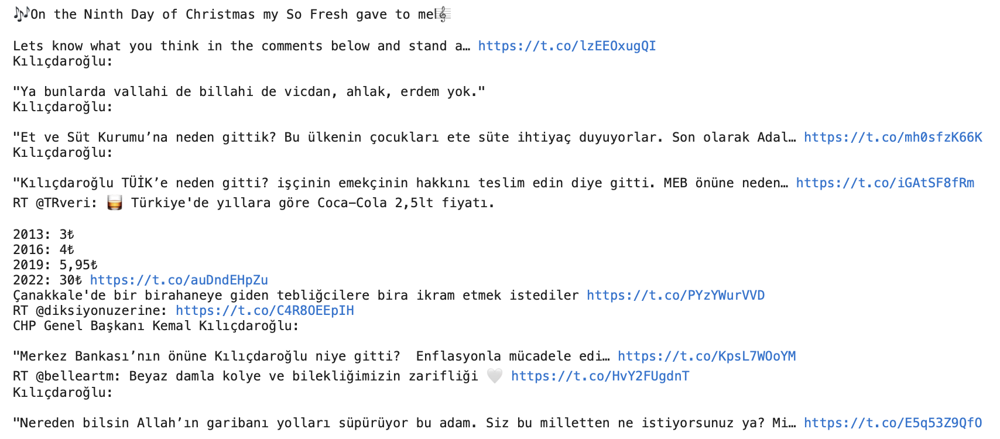
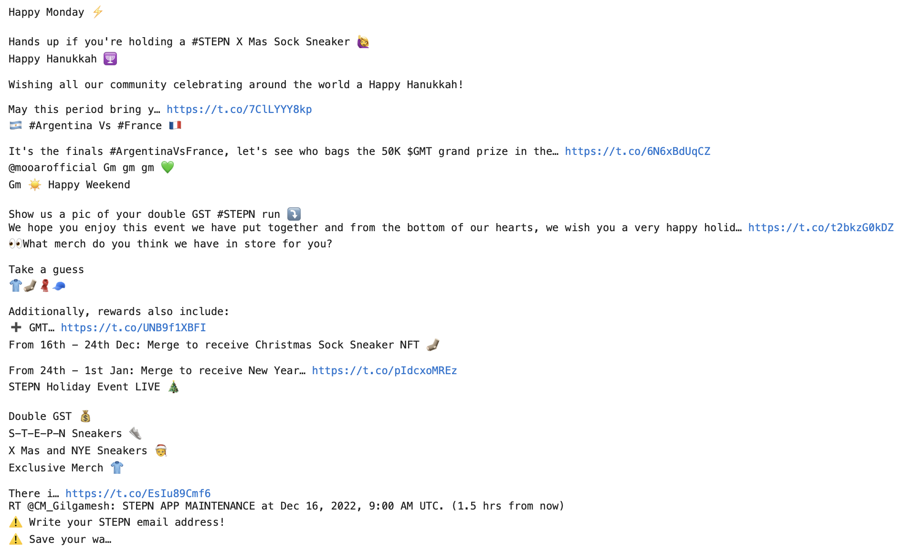
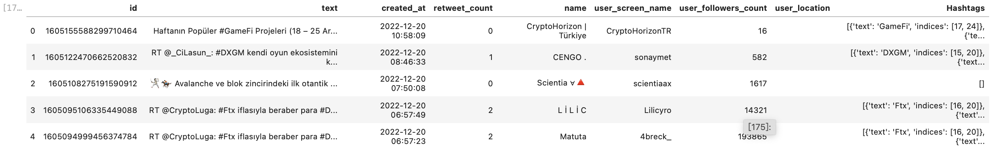
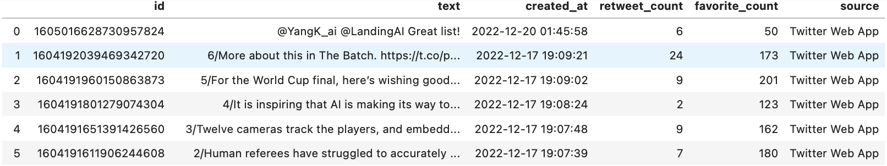
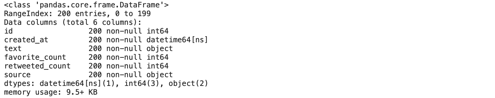
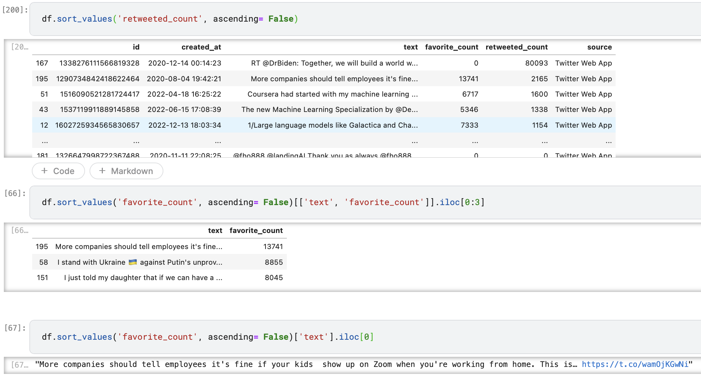
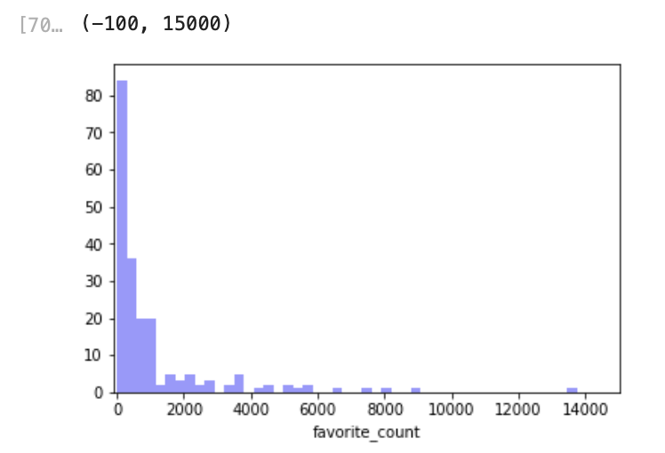
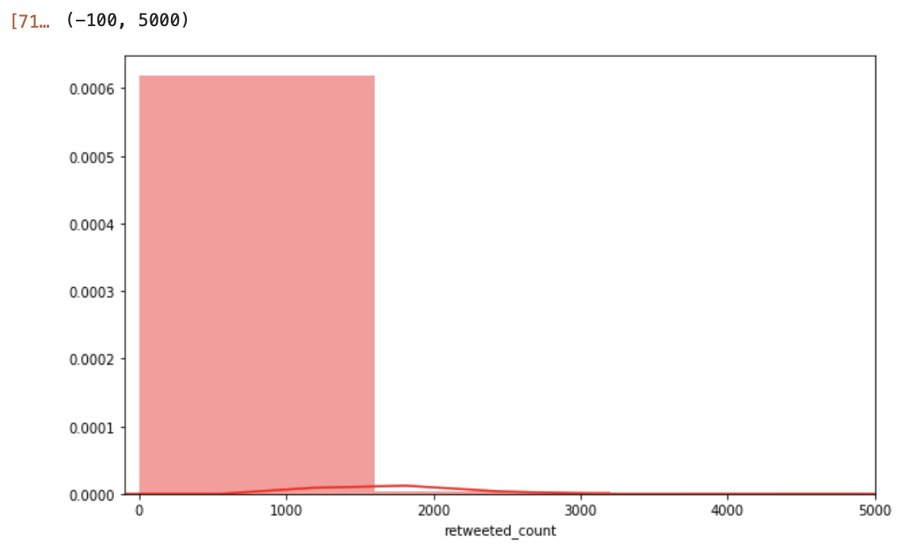
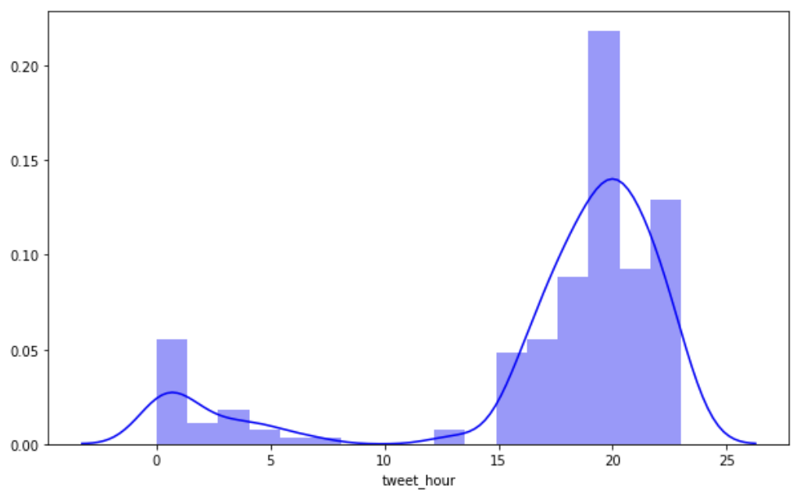
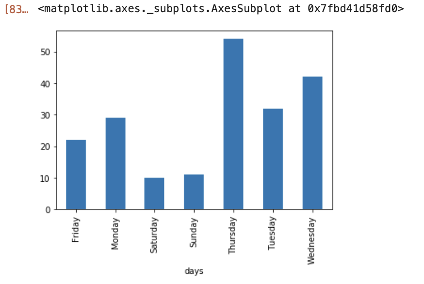

# Data Science Homework8

###### 109511119 施竣皓 2022/12/20

#### *The purpose of Homework8 is to "conduct text mining".*

## Overview
<!--
這次是最後一次作業，我想做的是有關社群網站上的文本分析。我瞄準的社群網站是Twiiter。Twiiter是源於美國的微部落格及社群網路服務平台。它可以讓使用者更新不超過280個字元的訊息（中文、日文和韓文為140個），這些訊息也被稱作「Tweet」。本次作業中，我將會進行一些Twitter上爬蟲的方法，以及進行一些文本分析，最後是進行文本挖掘。
-->

This is the last assignment I want to do, and it is about text analysis on social networking sites. The social networking site I'm aiming at is Twiiter, a micro-blogging and social networking platform originated in the United States. It allows users to update messages of no more than 280 characters (140 in Chinese, Japanese, and Korean), which are also known as "tweets". In this assignment, I will do some crawling methods on Twitter, as well as some text analysis and finally, text mining.

## Prerequisites
<!--
首先，我們需要先建置環境與下載需要的Library：Tweepy。
-->
First, we need to build the environment and download the required Library: Tweepy.

```bash=
$ pip install tweepy
```

## Basic parts

### To get data from Twitter
<!--
首先我們先針對 Tweepy 的一些常用語法進行一些示範與練習。
-->

First, we will demonstrate and practice some common syntax of Tweepy.

```python =
import tweepy, codecs
fk = api.me()

# We can use this to show the user name
fk.screen_name

# We can use this to show the user's followers number
fk.screen_name

# We can use this to list 10 friends of the user
for friend in fk.friends(count=10):
    print(friend.screen_name)

# We can also use another method to get other users
user = api.get_user(id = 'bsrakrsn')
user.screen_name
user.followers_count

# We can use the command to get the user's profile image URL
user.profile_image_url
```

<!--
接著我們要開始針對Twitter首頁上的文本進行爬蟲。我們先對首頁的前十條 Tweet 進行讀取
-->

Then we start crawling the text on the Twitter home page. We start by reading the first ten tweets from the home page:

```python =
public_tweets = api.home_timeline(count=10)
for tweet in public_tweets:
    print(tweet.text)
```


<!--
而後我們要開始針對Twitter的用戶首頁上的文本進行爬蟲。我們先對首頁的前十條 Tweet 進行讀取。這裡爬取的是 Web3的一個項目方經營的Twitter，StepN (@Stepnofficial)。

-->
Then we start crawling the text on the user's home page of Twitter. We'll start by reading the first ten tweets from the home page. Here we crawl the Twitter feed run by one of Web3's projects, StepN (@Stepnofficial).
```python =
name = 'Stepnofficial'
tweet_count = 10

user_timeline = api.user_timeline(id = name, count=tweet_count)

for i in user_timeline:
    print(i.text)
    
```



<!--
接著我們爬取 Hashtag。以下是對字句"gamefi"的 HashTag進行爬蟲的範例程式。
-->

The following is a sample program to crawl a HashTag with the word "gamefi".

```python =
results = api.search(q = '#gamefi',
                    lang = 'tr',
                    result_type = 'recent',
                    count = 1000000 )    
```
<!--
至此，我們已經完成最初步的爬蟲，抓取Twitter上有關 “gamefi” 相關的話題文本。
-->
At this point, we have completed our initial crawl of the Twitter feed for "gamefi" related topics.

### Pre-analysis
<!--
我們將基於上一步驟所獲取的"gamefi"文本內容，開始進行Text Mining的活動。

首先，我們要將剛剛混亂的格式進行整理，整理成DataFrame的模式方便我們進行後續的處理。
-->
We will start the Text Mining activity based on the "gamefi" text content we obtained in the previous step.

First, we need to organize the just confused format into a DataFrame pattern to facilitate our subsequent processing.

```python
import pandas as pd

# Define our INTERESTED columns, and convert to DataFrame format

def tweets_df(results):
    id_list = [tweet.id for tweet in results]
    data_set = pd.DataFrame(id_list,columns=['id'])
    
    
    data_set['text'] = [tweet.text for tweet in results]
    data_set['created_at'] = [tweet.created_at for tweet in results]
    data_set['retweet_count'] = [tweet.retweet_count for tweet in results]
    data_set['name'] = [tweet.author.name for tweet in results]
    data_set['user_screen_name'] = [tweet.author.screen_name for tweet in results]
    data_set['user_followers_count'] = [tweet.author.followers_count for tweet in results]
    data_set['user_location'] = [tweet.author.location for tweet in results]
    data_set['Hashtags'] = [tweet.entities.get('hashtags') for tweet in results]
    
    return data_set

data = tweets_df(results)
data.head()

```

<!--
接著，我們用上一小節所提到的一些指令來查看一下基本的信息。由於user_timeline需要授權 Token ，因此我們這裡無法繼續分析 StepN 項目。這裡改而分析單一用戶。
-->

Next, let's use some of the commands mentioned in the previous section to see the basic information. Since user_timeline requires a license token, we cannot continue analyzing StepN items here. Instead, we analyze a single user here.

```python
AndrewNg = api.get_user('AndrewNg')
AndrewNg.name
AndrewNg.id
AndrewNg.url
AndrewNg.verified
AndrewNg.screen_name
AndrewNg.statuses_count
AndrewNg.favourites_count
AndrewNg.friends_count
tweets = api.user_timeline(id = 'AndrewNg')
```
```python
tweets = api.user_timeline(id = 'AndrewYNg')

def timeline_df(tweets):
    id_list = [tweet.id for tweet in tweets]
    data_set = pd.DataFrame(id_list,columns=['id'])
    
    
    data_set['text'] = [tweet.text for tweet in tweets]
    data_set['created_at'] = [tweet.created_at for tweet in tweets]
    data_set['retweet_count'] = [tweet.retweet_count for tweet in tweets]
    data_set['favorite_count'] = [tweet.favorite_count for tweet in tweets]
    data_set['source'] = [tweet.source for tweet in tweets]

    
    return data_set

timeline_df(tweets)
```


Here we save the timeline information we read and obtain into a DataFrame format.
```python=
def timeline_df(tweets):
    df = pd.DataFrame()
    
    df['id'] = list(map(lambda tweet:tweet.id, tweets))
    df['created_at'] = list(map(lambda tweet:tweet.created_at, tweets))
    df['text'] = list(map(lambda tweet:tweet.text, tweets)) 
    df['favorite_count'] = list(map(lambda tweet:tweet.favorite_count, tweets))
    df['retweeted_count'] = list(map(lambda tweet:tweet.retweet_count, tweets))
    df['source'] = list(map(lambda tweet:tweet.source, tweets))
    return df
    
    return data_set
    
tweets = api.user_timeline(id = 'AndrewYNg',count=10000)
df = timeline_df(tweets)
df.info()
```



We can sort and organize our text as follows.
```python=
df.sort_values('retweeted_count', ascending= False)
df.sort_values('favorite_count', ascending= False)[['text', 'favorite_count']].iloc[0:3]
df.sort_values('favorite_count', ascending= False)['text'].iloc[0]
```


### Distribution of analysis
After the above crawler and text acquisition, we can start visualizing the data to see the general distribution of the data and what we can do with it.

First, we need to refer to some visualization tools.

```python =
%config InlineBacend.figure_format = 'retina'
import seaborn as sns
import matplotlib.pyplot as plt

sns.distplot(df.favorite_count, kde=False ,color='blue')
plt.xlim(-100,15000)
```

We can analyze the distribution of retweet.
```python =
plt.figure(figsize=(10,6))
sns.distplot(df.retweeted_count, color='red')
plt.xlim(-100,5000)
```


Next, we can analyze the Tweet-Hour division and study the time people use.
```python =
df['tweet_hour'] = df['created_at'].apply(lambda x: x.strftime('%H'))
df['tweet_hour'] = pd.to_numeric(df['tweet_hour'])
plt.figure(figsize=(10,6))
sns.distplot(df['tweet_hour'], kde=True, color='blue')
```

In addition to the length of use for a single day, we can also analyze the length of use for a week.
```python =
df['days'] = df['created_at'].dt.weekday_name
gun_freq = df.groupby('days').count()['id']
gun_freq.plot.bar(x='days', y='id')
```


The next step is to analyze how users are using the social media platforms.
```python =
source_freq = df.groupby('source').count()['id']
source_freq.plot.bar(x='source', y='id')
```


## Advanced parts

### Followers Segmentation

<!--我們在這一小節，將更深入的去分析，Followers Segmentation的部分。Followers segmentation是一種網絡商業策略，旨在將粉絲或追隨者按照一定的標準分組。這可以讓您更好地了解您的粉絲或追隨者，並為他們提供更有意義的內容和產品。

例如，將粉絲按照年齡、性別、興趣、位置或其他標準分組。這樣一來，就可以為各組提供面向該組特定目標的廣告和推廣活動。

通過將粉絲分組，您也可以更有效地瞄準潛在客戶，並為他們提供更適合他們需求的產品和服務。-->

In this section, we will go deeper into the segmentation of followers, which is an online business strategy designed to group your fans or followers according to certain criteria. This allows you to better understand your fans or followers and provide them with more meaningful content and products.

For example, group your fans by age, gender, interests, location, or other criteria. This way, you can provide advertising and promotions for each group that are targeted specifically to that group.

By grouping fans, you can also more effectively target potential customers and provide them with products and services that better suit their needs.

```python
user = api.get_user(id = 'AndrewYNg', count= 10000)
friends = user.friends()
followers = user.followers()

def followers_df(follower):
    idler = [i.id for i in follower]
    df = pd.DataFrame(idler, columns=['id'])
    
    
    df['created_at'] = [i.created_at for i in follower]
    df['screen_name'] = [i.screen_name for i in follower]
    df['location'] = [i.location for i in follower]
    df['followers_count'] = [i.followers_count for i in follower]
    df['statuses_count'] = [i.statuses_count for i in follower]
    df['friends_count'] = [i.friends_count for i in follower]
    df['favourites_count'] = [i.favourites_count for i in follower]
    
    return df
    
df = followers_df(followers)
df.head()
```



```python
df.index = df['screen_name']
s_data.head()
```

```python
s_data['followers_count'] = s_data['followers_count'] +0.01
s_data.head()
```

```python
s_data = s_data.apply(lambda x:(x-min(x)) / (max(x)- min(x))) #doing standardization
s_data['followers_count'] = s_data['followers_count'] +0.01
s_data['statuses_count'] = s_data['statuses_count'] +0.01
s_data.head()
```


<!--經過上方的轉換後，我們可以對資料進行打分數的處理：-->

After the above conversion, we can score the data.

```python
score = s_data['followers_count'] * s_data['statuses_count']
score.sort_values(ascending = False)
score
```


<!--打完分數後，我們就可以對我們的追蹤者進行分數上的評分：-->
After scoring, we can then rate our trackers on a scale of
```
import numpy as np
s_data['segment'] = np.where(s_data['score'] >=score.median() + score.std()/len(score) , 'A', 'B')
s_data
```


### Text Mining with Twitter


```python
df['text'] = df['text'].apply(lambda x: " ".join(x.lower() for x in x.split()))

df['text'] = df['text'].str.replace('[^\w\s]', '')

df['text'] = df['text'].str.replace('[\d]','')


import nltk
from nltk.corpus import stopwords
sw = stopwords.words('english')
df['text'] = df['text'].apply(lambda x: " ".join(x for x in x.split() if x not in sw))

#lemmi
from textblob import Word
df['text'] = df['text'].apply(lambda x: " ".join([Word(word).lemmatize() for word in x.split()] ))

df['text'] = df['text'].str.replace('rt', '')

df.text
```


```
freq_df = df['text'].apply(lambda x:pd.value_counts(x.split(" "))).sum(axis = 0).reset_index()
freq_df.columns = ['words', 'freqs']
freq_df.sort_values('freqs',ascending=False)
```

```
a = freq_df[freq_df.freqs > freq_df.freqs.mean() + 
       freq_df.freqs.std()] # this code for the being more meaningful
       
a.plot.bar(x= 'words', y= 'freqs')
```


### Word Cloud

```
import numpy as np
import pandas as pd
from os import path
from PIL import Image
from wordcloud import WordCloud , STOPWORDS, ImageColorGenerator
import matplotlib.pyplot as plt

text = " ".join(i for i in df.text)

text
```


```
wc = WordCloud(background_color='white').generate(text)
plt.figure(figsize=(10,6))
plt.imshow(wc, interpolation='bilinear')
plt.axis('off')
plt.tight_layout(pad = 0)
plt.show()

```


### Twitter Sentiment¶

```
from textblob import TextBlob

def sentiment_score(df):
    text = df['text']
    
    for i in range(0, len(text)):
        textB = TextBlob(text[i])
        sentiment_score = textB.sentiment.polarity
        df.set_value(i, 'sentiment_score', sentiment_score)
        
        
        if sentiment_score < 0.00:
            sentiment_class = 'Negative'
            df.set_value(i, 'sentiment_class', sentiment_class)
            
        elif sentiment_score > 0.00:
            sentiment_class ='Positive'
            df.set_value(i, 'sentiment_class', sentiment_class)
        else:
            sentiment_class = 'Notr'
            df.set_value(i, 'sentiment_class', sentiment_class)
    return df
    
sentiment_score(df)
```


```
df.groupby('sentiment_class').count()['id']
sentiment_freq = df.groupby('sentiment_class').count()['id']
sentiment_freq.plot.bar(x= 'sentiment_class', y='id')

```


```
tweets = api.search(q = '#apple', lang='en', count=5000)

def hashtag_df(results):
    id_list = [tweet.id for tweet in results]
    data_set = pd.DataFrame(id_list,columns=['id'])
    data_set['text'] = [tweet.text for tweet in results]
    data_set['created_at'] = [tweet.created_at for tweet in results]
    data_set['retweeted'] = [tweet.retweeted for tweet in results]
    data_set['retweet_count'] = [tweet.retweet_count for tweet in results]
    data_set['name'] = [tweet.author.name for tweet in results]
    data_set['user_screen_name'] = [tweet.author.screen_name for tweet in results]
    data_set['user_followers_count'] = [tweet.author.followers_count for tweet in results]
    data_set['user_location'] = [tweet.author.location for tweet in results]
    data_set['Hashtags'] = [tweet.entities.get('hashtags') for tweet in results]
    
    return data_set
df = hashtag_df(tweets)

df['text'] = df['text'].apply(lambda x: " ".join(x.lower() for x in x.split()))

df['text'] = df['text'].str.replace('[^\w\s]', '')

df['text'] = df['text'].str.replace('[\d]','')


import nltk
from nltk.corpus import stopwords
sw = stopwords.words('english')
df['text'] = df['text'].apply(lambda x: " ".join(x for x in x.split() if x not in sw))

#lemmi
from textblob import Word
df['text'] = df['text'].apply(lambda x: " ".join([Word(word).lemmatize() for word in x.split()] ))

df['text'] = df['text'].str.replace('rt', '')

def sentiment_score(df):
    text = df['text']
    
    for i in range(0, len(text)):
        textB = TextBlob(text[i])
        sentiment_score = textB.sentiment.polarity
        df.set_value(i, 'sentiment_score', sentiment_score)
        
        
        if sentiment_score < 0.00:
            sentiment_class = 'Negative'
            df.set_value(i, 'sentiment_class', sentiment_class)
            
        elif sentiment_score > 0.00:
            sentiment_class ='Positive'
            df.set_value(i, 'sentiment_class', sentiment_class)
        else:
            sentiment_class = 'Notr'
            df.set_value(i, 'sentiment_class', sentiment_class)
    return df
    
df = sentiment_score(df)

sentiment_freq = df.groupby('sentiment_class').count()['id']
sentiment_freq

```


```python=

sentiment_freq.plot.bar(x = 'sentiment_class', y= 'id')

```


## Future Work

<!--在這次的作業，我們碰了非常多的函式庫，主要的主題是環繞在 Text Mining 上。

文本挖掘是一種利用計算機程序提取有用信息的方法。它主要用於分析大量文本數據，以找出隱含在其中的模式和關係。文本挖掘技術广泛用于自然語言處理、情感分析、市場调研、自動摘要等領域。

在我們的日常生活中，文本數據無處不在。例如，我們每天都會收到大量電子郵件、社交媒體消息、新聞報道、商業文件等。這些文本數據中蘊藏著許多有價值的信息，如果能夠有效地提取出來，就可以為我們的生活和工作帶來更多的便利。

然而，文本挖掘也有許多挑戰。例如，文本數據中可能存在大量的噪聲和雜訊，這可能會影響提取信息的準確性。此外，文本挖掘需要考慮許多自然語言處理問題，例如語言差異、文化差異、拼寫和標點符號的混淆等。

尽管有這些挑戰，但文本挖掘仍然是一個非常有價值的工具。它能提高我們的工作效率，讓我們能夠快速提取出大量文本數據中的有用信息。通過使用文本挖掘技術，我們可以更好地了解客戶需求和市場趨勢，并設計更有效的產品和服務。

同時，這也是最後一次的作業，為這堂課畫上一個完美的句號。-->


In this assignment, we have touched a lot of libraries, and the main theme is around Text Mining.

Text mining is a method of extracting useful information using computer programs. It is mainly used to analyze large amount of text data to find out the patterns and relationships hidden in it. Text mining techniques are widely used in natural language processing, sentiment analysis, market research, automatic summarization, and other fields.

Text data is everywhere in our daily life. For example, we receive a lot of emails, social media messages, news reports, business documents, etc. every day. There is a lot of valuable information in these text data, and if we can extract it effectively, it can bring more convenience to our life and work.

However, there are many challenges in text mining. For example, there may be a lot of noise and clutter in the text data, which may affect the accuracy of the extracted information. In addition, text mining needs to consider many natural language processing issues, such as language differences, cultural differences, spelling and punctuation confusion, etc.

Despite these challenges, text mining is still a very valuable tool. It increases our productivity and allows us to quickly extract useful information from large amounts of text data. By using text mining technology, we can better understand customer needs and market trends, and design more effective products and services.

At the same time, this is the last assignment to bring the class to a perfect end.