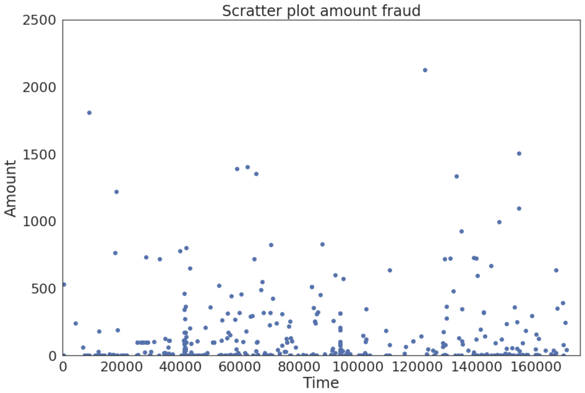
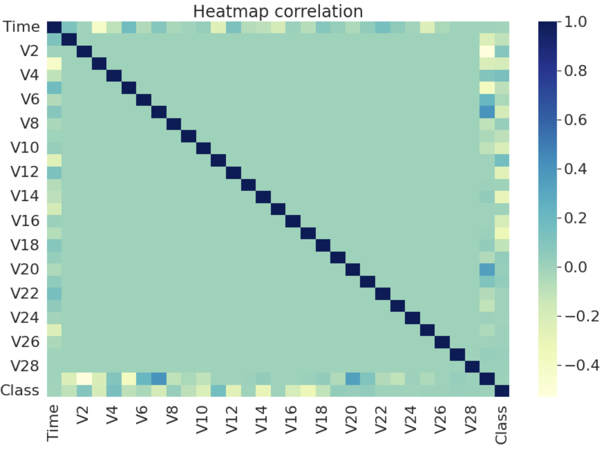
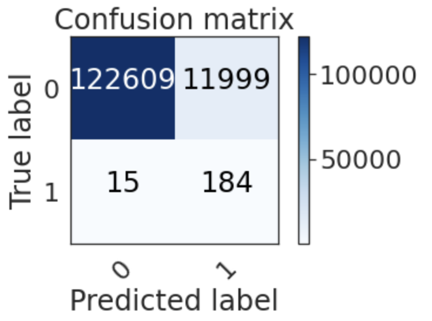
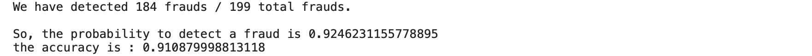
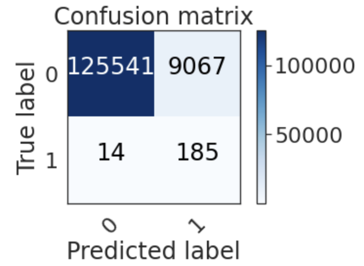
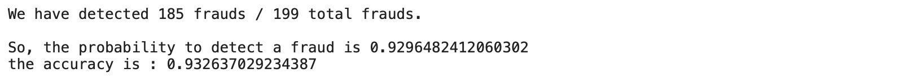
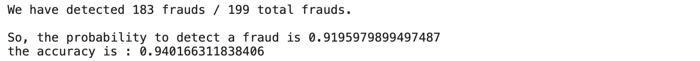
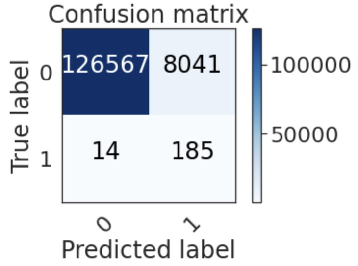
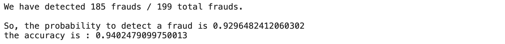

# Data Science Homework7

###### 109511119 施竣皓 2022/11/28

#### *The purpose of Homework7 is to "to perform classfication analysis of data sets".*

## Overview
<!--
我所選擇的資料集是基於Kaggle競賽：**Credit Card Fraud Detection** 所提供的資料，該競賽為了比賽常常會將資料挖空，來模擬真實世界中人為有意或無意造成的資料丟失。資料丟失或錯誤的狀況，可以讓ML科學家嘗試各種方法，來增強算法的魯棒性以及可用性。面對這樣的問題，我們將在這次的作業進行實作，處理資料集的資料丟失與資料錯誤問題。
-->

The dataset I have chosen is based on data provided by the Kaggle competition: **Credit Card Fraud Detection**, which often guts data for competitions to simulate real-world data loss, either intentionally or unintentionally. Data loss or error conditions allow ML scientists to try various approaches to enhance the robustness and usability of algorithms. In the face of such problems, we will conduct an implementation of this assignment to deal with data loss and data error problems in datasets.

## Dataset Introduction
The dataset contains transactions made by credit cards in September 2013 by European cardholders. 
This dataset presents transactions that occurred in two days, where we have 492 frauds out of 284,807 transactions. The dataset is highly unbalanced, the positive class (frauds) account for 0.172% of all transactions.

It contains only numerical input variables which are the result of a PCA transformation. Unfortunately, due to confidentiality issues, we cannot provide the original features and more background information about the data. Features V1, V2, … V28 are the principal components obtained with PCA, the only features which have not been transformed with PCA are 'Time' and 'Amount'. Feature 'Time' contains the seconds elapsed between each transaction and the first transaction in the dataset. The feature 'Amount' is the transaction Amount, this feature can be used for example-dependant cost-sensitive learning. Feature 'Class' is the response variable and it takes value 1 in case of fraud and 0 otherwise.

Given the class imbalance ratio, we recommend measuring the accuracy using the Area Under the Precision-Recall Curve (AUPRC). Confusion matrix accuracy is not meaningful for unbalanced classification.

## Prerequisites
<!--
首先，基於上次作業建好的環境，我們需要在終端機先確認環境是否已經滿足所有我們將使用到的函示庫。我們需要先引入下列的函示庫，以免產生報錯。
-->
First, based on the environment built in the first homework, we need to verify in the terminal that all the libraries we will use are satisfied. We need to introduce the following libraries first to avoid error reporting.

```bash=
$ pip3 install pandas
$ pip3 install numpy
$ pip3 install datetime
$ pip3 install plotly
$ pip3 install matplotlib
$ pip3 install time
$ pip3 install scipy
```
## Load the Dataset
<!--
首先先引入所有我們會使用到的 Library。
-->
Let's start by introducing all the Libraries that we will use.

```python =
#Importing librairies

import pandas as pd 
import numpy as np

# Scikit-learn library: For SVM
from sklearn import preprocessing
from sklearn.metrics import confusion_matrix
from sklearn import svm

import itertools

# Matplotlib library to plot the charts
import matplotlib.pyplot as plt
import matplotlib.mlab as mlab

# Library for the statistic data vizualisation
import seaborn
```

<!--接者開始引入我們將使用的資料集：-->
The receiver starts introducing the dataset we will be using.

```python
data = pd.read_csv('../input/creditcard.csv') # Reading the file .csv
df = pd.DataFrame(data) # Converting data to Panda DataFrame
```

## Data visualisation

We will start by visualising the Close prices for the two assets we have selected.

```python
df = pd.DataFrame(data) # Converting data to Panda DataFrame
df.describe() # Description of statistic features (Sum, Average, Variance, minimum, 1st quartile, 2nd quartile, 3rd Quartile and Maximum)
```
|       | Time          | V1            | V2            | V3            | V4            | V5            | V6            | V7            | V8            |
|-------|---------------|---------------|---------------|---------------|---------------|---------------|---------------|---------------|---------------|
| count | 284807.000000 | 2.848070e+05  | 2.848070e+05  | 2.848070e+05  | 2.848070e+05  | 2.848070e+05  | 2.848070e+05  | 2.848070e+05  | 2.848070e+05  |
| mean  | 94813.859575  | 1.168375e-15  | 3.416908e-16  | -1.379537e-15 | 2.074095e-15  | 9.604066e-16  | 1.487313e-15  | -5.556467e-16 | 1.213481e-16  |
| std   | 47488.145955  | 1.958696e+00  | 1.651309e+00  | 1.516255e+00  | 1.415869e+00  | 1.380247e+00  | 1.332271e+00  | 1.237094e+00  | 1.194353e+00  |
| min   | 0.000000      | -5.640751e+01 | -7.271573e+01 | -4.832559e+01 | -5.683171e+00 | -1.137433e+02 | -2.616051e+01 | -4.355724e+01 | -7.321672e+01 |
| 25%   | 54201.500000  | -9.203734e-01 | -5.985499e-01 | -8.903648e-01 | -8.486401e-01 | -6.915971e-01 | -7.682956e-01 | -5.540759e-01 | -2.086297e-01 |
| 50%   | 84692.000000  | 1.810880e-02  | 6.548556e-02  | 1.798463e-01  | -1.984653e-02 | -5.433583e-02 | -2.741871e-01 | 4.010308e-02  | 2.235804e-02  |
| 75%   | 139320.500000 | 1.315642e+00  | 8.037239e-01  | 1.027196e+00  | 7.433413e-01  | 6.119264e-01  | 3.985649e-01  | 5.704361e-01  | 3.273459e-01  |
| max   | 172792.000000 | 2.454930e+00  | 2.205773e+01  | 9.382558e+00  | 1.687534e+01  | 3.480167e+01  | 7.330163e+01  | 1.205895e+02  | 2.000721e+01  |
```python
df_fraud = df[df['Class'] == 1] # Recovery of fraud data
plt.figure(figsize=(15,10))
plt.scatter(df_fraud['Time'], df_fraud['Amount']) # Display fraud amounts according to their time
plt.title('Scratter plot amount fraud')
plt.xlabel('Time')
plt.ylabel('Amount')
plt.xlim([0,175000])
plt.ylim([0,2500])
plt.show()
```


## Correlation of features¶

```python =
df_corr = df.corr() # Calculation of the correlation coefficients in pairs, with the default method:
                    # Pearson, Standard Correlation Coefficient
                    
plt.figure(figsize=(15,10))
seaborn.heatmap(df_corr, cmap="YlGnBu") # Displaying the Heatmap
seaborn.set(font_scale=2,style='white')

plt.title('Heatmap correlation')
plt.show()
```


As we can notice, most of the features are not correlated with each other. This corroborates the fact that a PCA was previously performed on the data.

add Codeadd Markdown
What can generally be done on a massive dataset is a dimension reduction. By picking th emost important dimensions, there is a possiblity of explaining most of the problem, thus gaining a considerable amount of time while preventing the accuracy to drop too much.

add Codeadd Markdown
However in this case given the fact that a PCA was previously performed, if the dimension reduction is effective then the PCA wasn't computed in the most effective way. Another way to put it is that no dimension reduction should be computed on a dataset on which a PCA was computed correctly.


## Data Selection

```python
# We seperate ours data in two groups : a train dataset and a test dataset

# First we build our train dataset
df_train_all = df[0:150000] # We cut in two the original dataset
df_train_1 = df_train_all[df_train_all['Class'] == 1] # We seperate the data which are the frauds and the no frauds
df_train_0 = df_train_all[df_train_all['Class'] == 0]
print('In this dataset, we have ' + str(len(df_train_1)) +" frauds so we need to take a similar number of non-fraud")

df_sample=df_train_0.sample(300)
df_train = df_train_1.append(df_sample) # We gather the frauds with the no frauds. 
df_train = df_train.sample(frac=1) # Then we mix our dataset
```

In this dataset, we have 293 frauds so we need to take a similar number of non-fraud


```python
X_train = df_train.drop(['Time', 'Class'],axis=1) # We drop the features Time (useless), and the Class (label)
y_train = df_train['Class'] # We create our label
X_train = np.asarray(X_train)
y_train = np.asarray(y_train)

############################## with all the test dataset to see if the model learn correctly ##################
df_test_all = df[150000:]

X_test_all = df_test_all.drop(['Time', 'Class'],axis=1)
y_test_all = df_test_all['Class']
X_test_all = np.asarray(X_test_all)
y_test_all = np.asarray(y_test_all)
```
Then we define training and testing set after applying a dimension reduction to illustrate the fact that nothing will be gained because a PCA was previously computed

``` python =
X_train_rank = df_train[df_rank.index[1:11]] # We take the first ten ranked features
X_train_rank = np.asarray(X_train_rank)
############################## with all the test dataset to see if the model learn correctly ##################
X_test_all_rank = df_test_all[df_rank.index[1:11]]
X_test_all_rank = np.asarray(X_test_all_rank)
y_test_all = np.asarray(y_test_all)
```

## Confusion Matrix


```python
class_names=np.array(['0','1']) # Binary label, Class = 1 (fraud) and Class = 0 (no fraud)

# Function to plot the confusion Matrix
def plot_confusion_matrix(cm, classes,
                          title='Confusion matrix',
                          cmap=plt.cm.Blues):
    
    plt.imshow(cm, interpolation='nearest', cmap=cmap)
    plt.title(title)
    plt.colorbar()
    tick_marks = np.arange(len(classes))
    plt.xticks(tick_marks, classes, rotation=45)
    plt.yticks(tick_marks, classes)

    fmt = 'd' 
    thresh = cm.max() / 2.
    for i, j in itertools.product(range(cm.shape[0]), range(cm.shape[1])):
        plt.text(j, i, format(cm[i, j], fmt),
                 horizontalalignment="center",
                 color="white" if cm[i, j] > thresh else "black")

    plt.tight_layout()
    plt.ylabel('True label')
    plt.xlabel('Predicted label')
```


## Model Selection
So now, we'll use a SVM model classifier, with the scikit-learn library.

```python
classifier = svm.SVC(kernel='linear') # We set a SVM classifier, the default SVM Classifier (Kernel = Radial Basis Function)
classifier.fit(X_train, y_train) # Then we train our model, with our balanced data train.
```

## Testing the model

```python
fprediction_SVM_all = classifier.predict(X_test_all) #And finally, we predict our data test.

cm = confusion_matrix(y_test_all, prediction_SVM_all)
plot_confusion_matrix(cm,class_names)
```

In this case we are gonna try to minimize the number of errors in our prediction results. Errors are on the anti-diagonal of the confusion matrix. But we can infer that being wrong about an actual fraud is far worse than being wrong about a non-fraud transaction.

add Codeadd Markdown
That is why using the accuracy as only classification criterion could be considered unthoughtful. During the remaining part of this study our criterion will consider precision on the real fraud 4 times more important than the general accuracy. Even though the final tested result is accuracy.

``` python =
print('Our criterion give a result of ' 
      + str( ( (cm[0][0]+cm[1][1]) / (sum(cm[0]) + sum(cm[1])) + 4 * cm[1][1]/(cm[1][0]+cm[1][1])) / 5))
```


``` python =
print('We have detected ' + str(cm[1][1]) + ' frauds / ' + str(cm[1][1]+cm[1][0]) + ' total frauds.')
print('\nSo, the probability to detect a fraud is ' + str(cm[1][1]/(cm[1][1]+cm[1][0])))
print("the accuracy is : "+str((cm[0][0]+cm[1][1]) / (sum(cm[0]) + sum(cm[1]))))
```


## Models Rank
There is a need to compute the fit method again, as the dimension of the tuples to predict went from 29 to 10 because of the dimension reduction.

```python
classifier.fit(X_train_rank, y_train) # Then we train our model, with our balanced data train.
prediction_SVM = classifier.predict(X_test_all_rank) #And finally, we predict our data test.

classifier.fit(X_train_rank, y_train) # Then we train our model, with our balanced data train.
prediction_SVM = classifier.predict(X_test_all_rank) #And finally, we predict our data test.
```


``` python=
print('Our criterion give a result of ' 
      + str( ( (cm[0][0]+cm[1][1]) / (sum(cm[0]) + sum(cm[1])) + 4 * cm[1][1]/(cm[1][0]+cm[1][1])) / 5))
```

```python =
print('We have detected ' + str(cm[1][1]) + ' frauds / ' + str(cm[1][1]+cm[1][0]) + ' total frauds.')
print('\nSo, the probability to detect a fraud is ' + str(cm[1][1]/(cm[1][1]+cm[1][0])))
print("the accuracy is : "+str((cm[0][0]+cm[1][1]) / (sum(cm[0]) + sum(cm[1]))))

```


We can see that the study using the reduced data is far from unrelevant, which means that the last step of the previously computed PCA could have been done in a more efficient way. Indeed one of the main question we have with the PCA once we calculated the principals components direction, is how many of this component are we gonna keep. This means that some of the 30 dimensions are do not discriminate classes that much.

## Re-balanced class weigh

In this previously used SVM model, the weigh of each class was the same, which means that missing a fraud is as bad as misjudging a non-fraud. The objective, for a bank, is to maximize the number of detected frauds! Even if it means considering more non-fraud tuple as fraudulent operation. So, we need to minimize the False positives : the number of no detected frauds.

Indeed, by modifying the class_weight parameter, we can chose which class to give more importance during the training phase. In this case, the class_1 which describes the fraudulent operations will be considered more important than the class_0 (non-fraud operation). However, in this case we will give more importance to the class_0 due to the large number of misclassed non-fraud operation. Of course the goal is to lose as little effective fraud as possible in the process.

``` python =
classifier_b = svm.SVC(kernel='linear',class_weight={0:0.60, 1:0.40})
classifier_b.fit(X_train, y_train) # Then we train our model, with our balanced data train.
```

## Testing the model
``` python =

prediction_SVM_b_all = classifier_b.predict(X_test_all) #We predict all the data set.

cm = confusion_matrix(y_test_all, prediction_SVM_b_all)
plot_confusion_matrix(cm,class_names)
```


``` python=

print('Our criterion give a result of ' 
      + str( ( (cm[0][0]+cm[1][1]) / (sum(cm[0]) + sum(cm[1])) + 4 * cm[1][1]/(cm[1][0]+cm[1][1])) / 5))
```


``` python =
print('We have detected ' + str(cm[1][1]) + ' frauds / ' + str(cm[1][1]+cm[1][0]) + ' total frauds.')
print('\nSo, the probability to detect a fraud is ' + str(cm[1][1]/(cm[1][1]+cm[1][0])))
print("the accuracy is : "+str((cm[0][0]+cm[1][1]) / (sum(cm[0]) + sum(cm[1]))))
```



## Model rank

``` python =
classifier_b.fit(X_train_rank, y_train) # Then we train our model, with our balanced data train.
prediction_SVM = classifier_b.predict(X_test_all_rank) #And finally, we predict our data test.

cm = confusion_matrix(y_test_all, prediction_SVM)
plot_confusion_matrix(cm,class_names)

```



``` python
print('Our criterion give a result of ' 
      + str( ( (cm[0][0]+cm[1][1]) / (sum(cm[0]) + sum(cm[1])) + 4 * cm[1][1]/(cm[1][0]+cm[1][1])) / 5))
```


``` python =
print('We have detected ' + str(cm[1][1]) + ' frauds / ' + str(cm[1][1]+cm[1][0]) + ' total frauds.')
print('\nSo, the probability to detect a fraud is ' + str(cm[1][1]/(cm[1][1]+cm[1][0])))
print("the accuracy is : "+str((cm[0][0]+cm[1][1]) / (sum(cm[0]) + sum(cm[1]))))
```


